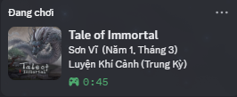

# Tale of Immortal Discord Rich Presence Mod (Vietnamese)

**Tale of Immortal Discord RPC Mod** - A Discord Rich Presence mod for "Tale of Immortal" (Quỷ Cốc Bát Hoang / 鬼谷八荒) localized in Vietnamese. Works with MelonLoader.

## SEO Keywords
Tale of Immortal Discord RPC, Tale of Immortal Discord Rich Presence, Tale of Immortal mod, Tale of Immortal Discord status, Quỷ Cốc Bát Hoang Discord RPC, Quỷ Cốc Bát Hoang mod, Tale of Immortal cultivation tracker, Tale of Immortal MelonLoader mod, TOI Discord RPC, Tale of Immortal Vietnamese localization.

## Features
- Displays character name accurately (joins Il2CppStringArray).
- Shows cultivation realm in Vietnamese (Luyện Khí Cảnh, Trúc Cơ Cảnh, Kim Đan Cảnh, Nguyên Anh Cảnh, Đăng Tiên Cảnh, etc.).
- Supports all 10 cultivation realms with proper phase mapping (Sơ Kỳ, Trung Kỳ, Hậu Kỳ).
- Displays in-game year and month in Vietnamese.
- Optimized performance, lag-free.
- Compatible with all save versions.

## Supported Cultivation Realms
- Luyện Khí Cảnh (Sơ/Trung/Hậu Kỳ)
- Trúc Cơ Cảnh (Sơ/Trung/Hậu Kỳ)
- Kết Tinh Cảnh (Sơ/Trung/Hậu Kỳ)
- Kim Đan Cảnh (Sơ/Trung/Hậu Kỳ)
- Cụ Linh Cảnh (Sơ/Trung/Hậu Kỳ)
- Nguyên Anh Cảnh (Sơ/Trung/Hậu Kỳ)
- Hoá Thần Cảnh (Sơ/Trung/Hậu Kỳ)
- Ngộ Đạo Cảnh (Sơ/Trung/Hậu Kỳ)
- Vũ Hóa Cảnh (Sơ/Trung/Hậu Kỳ)
- Đăng Tiên Cảnh (Sơ/Trung/Hậu Kỳ)

## Files
- `TOI_RPC.dll`: The main mod assembly (Place in `Mods` folder).
- `discord-rpc.dll`: Native Discord library (Place in game root or `Mods` folder).
- `Main.cs`: Source code for the mod.
- `DiscordRpc.cs`: Native wrapper.
- `TOI_RPC.csproj`: Visual Studio Project file.

## Installation
1. Install [MelonLoader](https://melonwiki.xyz/).
2. Place `TOI_RPC.dll` into the `Mods` directory of your game.
3. Ensure `discord-rpc.dll` is available (usually sits in the game root).

## Compatible With
- Tale of Immortal (鬼谷八荒)
- MelonLoader
- All game versions

## Support
For issues and questions, please open an issue on GitHub.

Developed by Dutch25.
